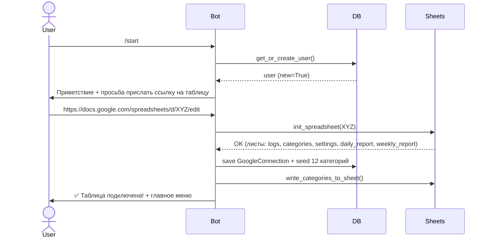
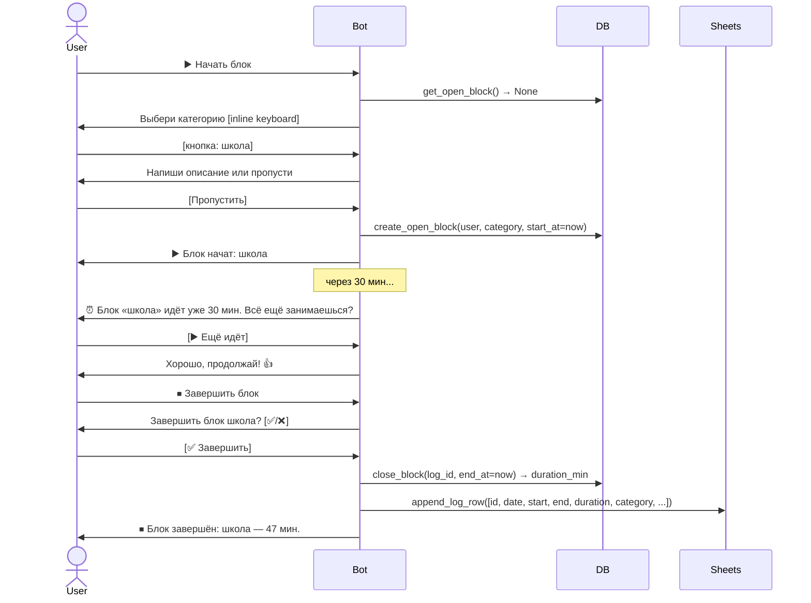
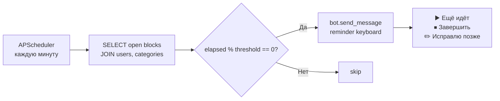

# TimeMirror — Telegram Time Tracker

Минималистичный трекер времени: Telegram как основной ввод, PostgreSQL как источник истины, Google Sheets для просмотра и правок.

---

## Как это работает

Пользователь нажимает кнопку → выбирает категорию → бот фиксирует начало блока в БД.
Когда заканчивает → нажимает «Завершить» → бот закрывает блок, считает длительность, пушит строку в Google Таблицу.
Вечером приходит краткий отчёт. В воскресенье — недельный. Всё.

---

## Архитектура

```
Internet
   │
   ▼ HTTPS :443
┌──────────┐
│  nginx   │  (self-signed SSL, reverse proxy на хосте)
└────┬─────┘
     │ proxy_pass 127.0.0.1:8000
     ▼
┌─────────────────────────────┐
│  Docker: app container      │
│                             │
│  FastAPI  ─── /webhook ──►  │  ◄─── Telegram Bot API
│  aiogram Dispatcher         │
│  APScheduler                │
└────────────┬────────────────┘
             │ asyncpg
             ▼
┌─────────────────────────────┐
│  Docker: db container       │
│  PostgreSQL 16              │
└─────────────────────────────┘

             ┌──────────────────┐
             │  Google Sheets   │  ◄── gspread (sync in thread)
             │  (per user)      │
             └──────────────────┘

             ┌──────────────────┐
             │  DeepSeek AI     │  ◄── openai-compatible API
             │  (summaries)     │
             └──────────────────┘
```

---

## Сценарии пользователя

### Онбординг



### Начало и завершение блока



### Напоминания (фон)



---

## Структура базы данных

```
users
  ├── user_settings      (1:1)
  ├── google_connections (1:1)
  ├── categories         (1:N)  ← 12 дефолтных при онбординге
  └── activity_logs      (1:N)
        └── category_id → categories

sync_events     ← аудит пушей в Sheets
daily_aggregates  ← кэш ежедневной статистики
weekly_aggregates ← кэш недельной статистики
```

---

## Модули

```
timemirror/
├── main.py                      FastAPI app + aiogram webhook + scheduler start
├── config.py                    pydantic-settings (.env)
│
├── bot/
│   ├── keyboards.py             Все клавиатуры (main_menu, categories, reminder...)
│   ├── messages.py              Все тексты сообщений
│   └── handlers/
│       ├── onboarding.py        /start, FSM ожидания ссылки на таблицу
│       ├── activity.py          Начать/завершить блок, выбор категории, описание
│       └── reminder.py          Обработка кнопок напоминания
│
├── db/
│   ├── models.py                SQLAlchemy ORM (8 таблиц)
│   ├── session.py               AsyncEngine + AsyncSessionFactory
│   └── repositories/
│       ├── user_repo.py         get_or_create_user, set_google_sheet_connected
│       ├── category_repo.py     seed_default_categories, get_user_categories
│       └── activity_repo.py     get_open_block, create_open_block, close_block
│
├── services/
│   ├── activity_service.py      start_block, finish_block, sync_log_to_sheet
│   ├── reminder_service.py      send_open_block_reminders (scheduler job)
│   ├── analytics_service.py     build_daily_aggregates (scheduler job)
│   └── summary_service.py       send_evening_reports, send_weekly_reports (DeepSeek)
│
├── scheduler/
│   └── jobs.py                  APScheduler setup (reminder/daily/evening/weekly)
│
├── integrations/
│   └── google_sheets.py         extract_id, init_spreadsheet, append_log_row...
│
└── migrations/
    └── env.py                   Alembic async migrations
```

---

## Google Sheets структура

| Лист | Назначение |
|------|-----------|
| `logs` | Все блоки активности. Правки → подтягиваются обратно в БД |
| `categories` | Список категорий пользователя |
| `settings` | Настройки (reminder_minutes, timezone...) |
| `daily_report` | Ежедневные агрегаты |
| `weekly_report` | Недельные агрегаты + AI-резюме |

---

## Прогресс реализации

| Сессия | Что сделано | Статус |
|--------|------------|--------|
| 1 | VPS + Docker + nginx + SSL + Google SA | ✅ |
| 2 | Dockerfile, docker-compose, config, models (8 таблиц), Alembic, /health | ✅ |
| 3 | keyboards, messages, onboarding handler, google_sheets integration, user/category repos | ✅ |
| 4 | activity_repo, activity_service, start/finish block handlers | ✅ |
| 5 | reminder_service, scheduler/jobs, reminder handler | ✅ |
| 6 | analytics_service (агрегаты), summary_service (DeepSeek отчёты) | 🔜 |
| 7 | sheets_sync_service (pull правок из Sheets → DB) | 🔜 |
| 8 | status handler, settings handler, main.py (всё собрать вместе) | 🔜 |
| 9 | docker compose up + webhook register + e2e тест в боте | 🔜 |

---

## Стек

- Python 3.12
- aiogram 3.17.0 (Telegram, async)
- FastAPI 0.115.12 (webhook endpoint)
- SQLAlchemy 2.x + asyncpg 0.30.0
- PostgreSQL 16 (Docker)
- APScheduler 3.11.0
- gspread 6.1.4 / Google Sheets API v4
- Alembic 1.15.2
- DeepSeek AI (OpenAI-compatible)
- Docker 29.4.1 + Docker Compose v5.1.3
- nginx (reverse proxy + SSL)

---

## Быстрый старт (VPS)

```bash
cd /opt/timemirror
docker compose up -d
docker compose exec app alembic upgrade head
# Зарегистрировать webhook:
curl -X POST "https://api.telegram.org/bot<TOKEN>/setWebhook" \
  -d "url=https://<YOUR_DOMAIN_OR_IP>/webhook"
```
